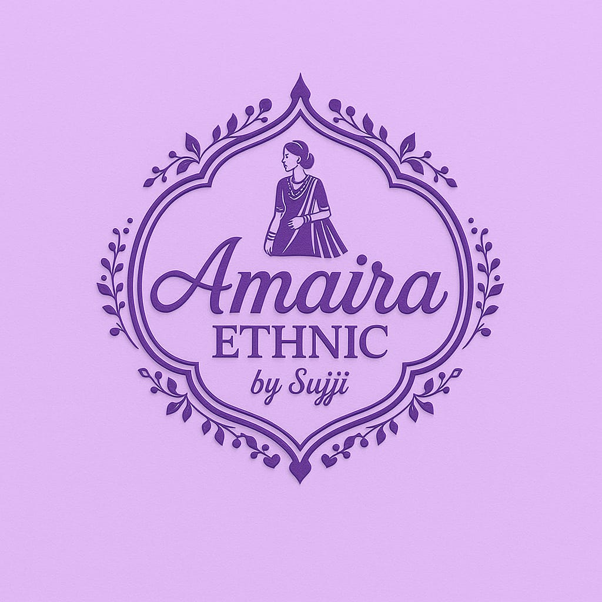

<div align="center">



# 🪡 Amaira Ethnic by Sujji

**_Elegance Refined · Tradition Preserved_**

[](https://amaira-ethnic-by-sujji.vercel.app)
[](https://react.dev)
[](https://vitejs.dev)
[](https://www.framer.com/motion/)

</div>

---

## ✨ About the Project

**Amaira Ethnic by Sujji** is a premium boutique e-commerce platform for handcrafted ethnic wear — Kurthis, co-ord sets, and traditional Indian clothing — curated for the modern Indian woman.

> _"I am a brave girl who completed my MBA and chose to work for my passion."_
> — **Sujji**, Founder of Amaira Ethnic

The brand proudly serves **1000s of happy customers** across India, offering budget-friendly (₹499+) yet high-quality ethnic fashion since its founding.

---

## 🛍️ Features

| Feature | Description |
|---|---|
| 🏠 **Home Page** | Hero banner, best-seller carousel, category grid & brand marquee |
| 🛒 **Shop** | Filterable product catalog with rich product cards |
| 📦 **Product Details** | Full image gallery, size selector, add-to-cart animation |
| 🛍️ **Cart Drawer** | Smooth slide-in cart with quantity controls |
| 💳 **Checkout** | Complete order form with WhatsApp order integration |
| 📖 **About / Brand Story** | Founder story, stats, image gallery |
| 📱 **Fully Responsive** | Mobile-first design, pixel-perfect on all screen sizes |
| 💬 **WhatsApp Button** | Floating one-tap WhatsApp contact |
| 🔒 **Image Protection** | Watermark overlay, right-click & drag block, print blur |

---

## 🎨 Tech Stack

<div align="center">

| Technology | Purpose |
|---|---|
| ⚛️ **React 19** | UI framework |
| ⚡ **Vite 8** | Build tool & dev server |
| 🎞️ **Framer Motion** | Page & component animations |
| 🔀 **React Router v7** | Client-side routing |
| 🎨 **CSS Modules** | Scoped, maintainable styles |
| ✨ **Lucide React** | Icon library |
| 🎊 **Canvas Confetti** | Order success celebration |

</div>

---

## 📂 Project Structure

```
amaira-ethnic-by-sujji/
├── public/                  # Static assets (product images, gallery)
├── src/
│   ├── assets/              # Module-imported assets (hashed at build)
│   ├── components/          # Reusable UI components
│   │   ├── Navbar           # Navigation with cart badge
│   │   ├── CartDrawer       # Slide-in cart
│   │   ├── BrandStory       # About / founder section
│   │   ├── Hero             # Landing hero banner
│   │   ├── CategoryGrid     # Shop by category
│   │   ├── ProductCard      # Product listing card
│   │   ├── Footer           # Site footer
│   │   └── WhatsAppButton   # Floating WhatsApp CTA
│   ├── pages/               # Route-level pages
│   │   ├── Home.jsx
│   │   ├── Shop.jsx
│   │   ├── Product.jsx
│   │   ├── About.jsx
│   │   └── Checkout.jsx
│   ├── context/             # React Context (cart state)
│   ├── data/                # Product data
│   └── styles/              # Global CSS variables & tokens
└── package.json
```

---

## 🚀 Getting Started

### Prerequisites

- Node.js `v18+`
- npm `v9+`

### Installation

```bash
# 1. Clone the repository
git clone https://github.com/varunkumar06011/Amaira-Ethnic-By-sujji-.git

# 2. Navigate to project
cd Amaira-Ethnic-By-sujji-

# 3. Install dependencies
npm install

# 4. Start development server
npm run dev
```

Open [http://localhost:5173](amaira-ethnic-by-sujji.vercel.app) in your browser.

### Build for Production

```bash
npm run build
npm run preview
```

---

## 📸 Pages at a Glance

| Page | Route |
|---|---|
| Home | `/` |
| Shop | `/shop` |
| Product Detail | `/product/:id` |
| About | `/about` |
| Checkout | `/checkout` |

---

## 🔐 Image Protection

The founder/client photos on this site are protected with multiple layers:

- **Diagonal watermark** overlay — `© amaira-ethnic-by-sujji`
- **Right-click & drag disabled** via JavaScript event prevention
- **CSS `user-select: none`** and `-webkit-user-drag: none`
- **Print blur** — `filter: blur(20px)` applied on `@media print`
- **Hashed asset filenames** — images imported as modules (not in `/public`)
- **800px max-width cap** — looks fine on screen, poor quality if stolen

---

## 💌 Contact & Social

| Platform | Link |
|---|---|
| 📸 Instagram | [@amaira.ethnic](https://www.instagram.com/amaira.ethnic) |
| 💬 WhatsApp | Direct from website |

---

## 👨‍💻 Developer

Built with ❤️ by **[Varun Kumar](https://github.com/varunkumar06011)**

> _Freelance project — All design & development rights reserved._

---

<div align="center">

⭐ **If you like this project, give it a star!** ⭐

<sub>© 2025 Amaira Ethnic by Sujji · All Rights Reserved</sub>

</div>
